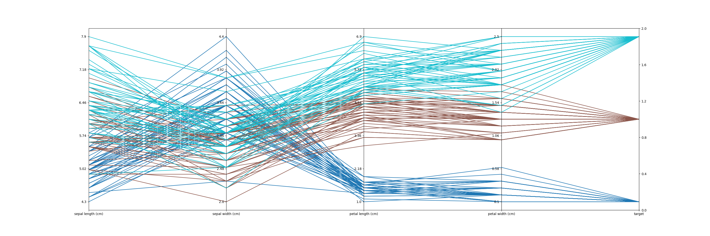

# plotszoo


**[Documentation]()**


This repository contains a collection of classes to easily make some common plots as well as retrieving data from multiple sources.

This project mostly fits my needs and it doesn't want to be in any way complete nor general purpose.

Feel free to use submit your own plots, bugfixes, requests or ideas. Any PR is very welcomed.

*Repository under active development, braking changes may (and will) occur*

## Example

```
import numpy as np
import pandas as pd
import matplotlib.pyplot as plt
from sklearn.datasets import load_iris
import plotszoo


iris = load_iris()
scalars = pd.DataFrame(data= np.c_[iris["data"], iris["target"]], columns=iris["feature_names"] + ["target"])

data = plotszoo.data.DataCollection()
data.set_scalars(scalars)

fig, axes = plt.subplots(1, len(iris["feature_names"]), sharey=False)

parallel_plot = plotszoo.scalars.ScalarsParallelCoordinates(data, iris["feature_names"], "target")

parallel_plot.plot(axes, cmap="tab10")

fig.set_size_inches(30, 10)
plt.show()
```




## Contributions and license

The code is released as Free Software under the [GNU/GPLv3](https://choosealicense.com/licenses/gpl-3.0/) license. Coping, adapting e republishing it is not only consent but also encouraged. 

For any further question feel free to reach me at  [federico.galatolo@ing.unipi.it](mailto:federico.galatolo@ing.unipi.it) or on Telegram  [@galatolo](https://t.me/galatolo)